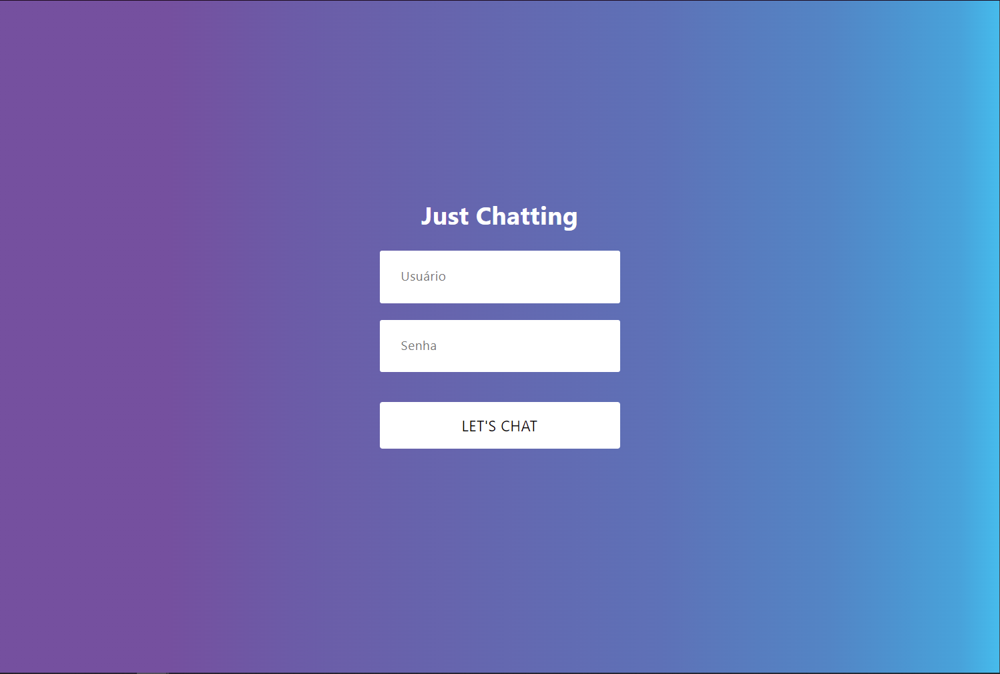
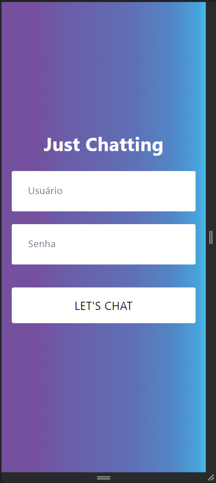
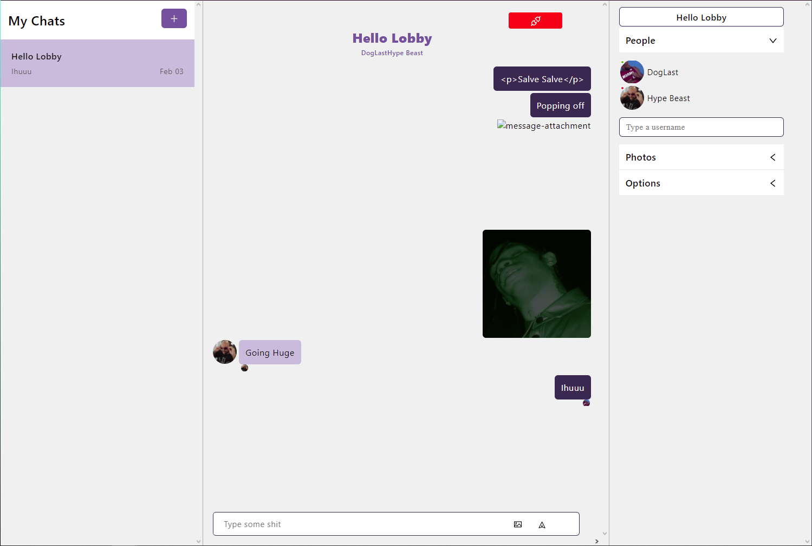
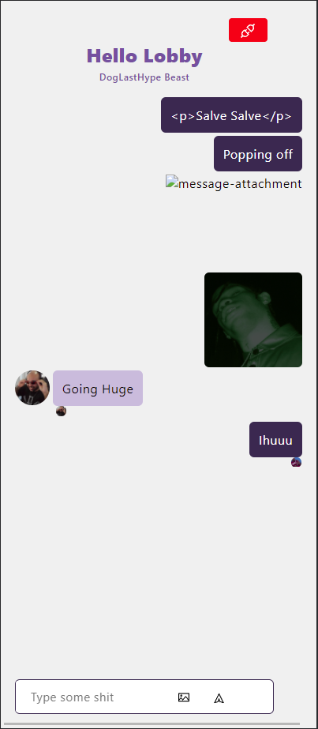

<h1 align="center">
 
Just Chatting
</h1>

Responsive chat application using React JS, inspired on Microsoft Teams

  

## Screenshot 📷

-📌 **Login**
<pre>

                 

</pre>

-📌 **Chat**
<pre>
                 

</pre>

## Features 🗃️
This app features all the latest tools and practices in mobile development!

- **ReactJS** 
- **React-Chat-Engine**
- **Axios**

## License 📃

This project is licensed under the MIT License - see the [LICENSE](https://opensource.org/licenses/MIT) page for details.
